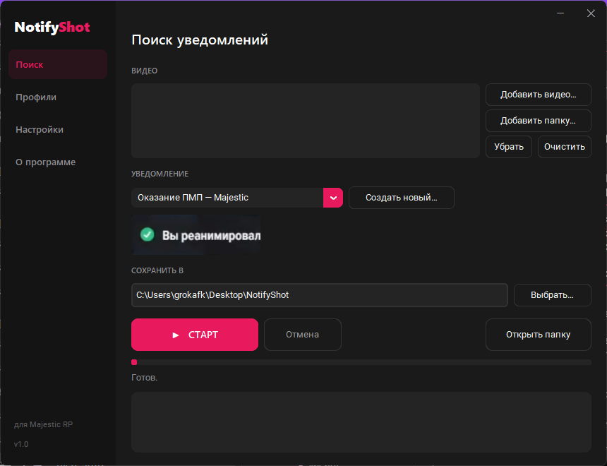

<p align="center">
  
</p>

# NotifyShot

[](https://github.com/grokkiafk/NotifyShot/releases/latest)
[](https://www.python.org/)
[](https://opencv.org/)
[](https://ffmpeg.org/)
[](#)
[](LICENSE)

**Автоматическая нарезка скриншотов по игровому уведомлению из видео.**



Кидаешь длинную запись игры → выбираешь, что искать (например «Вы реанимировали»)
→ получаешь папку со скриншотами, по одному (или несколько) на каждое срабатывание
уведомления. Удобно для отчётов, монтажа, статистики.

Работает на любом разрешении записи (720p / 1080p / 1440p…) и не зависит от того,
в каком углу экрана появляется плашка.

*Пример: из ~6.4 часов записи автоматически вытащено 43 момента оказания ПМП —*


---

## Как это работает

1. Из видео декодируются **только ключевые кадры** (обычно 1 раз в ~2 секунды) —
   это в десятки раз быстрее, чем перебирать все кадры.
2. В зоне, где появляется уведомление, ищется **шаблон** (картинка-образец) методом
   нормализованного шаблонного сопоставления (OpenCV `matchTemplate`).
3. Подряд идущие совпадения объединяются в одно «событие», и из исходного видео
   вырезается полный кадр в **PNG**.

## Запуск (для пользователя)

1. Скачайте релиз, распакуйте архив.
2. Запустите **`NotifyShot.exe`**.
3. **Видео** → добавьте файлы или папку.
4. **Что искать** → выберите профиль (в комплекте — «Оказание ПМП — Majestic»).
5. **Куда сохранять** → папка для скриншотов.
6. **СТАРТ**. По окончании предложит открыть папку с результатами.

> ffmpeg уже вшит в релиз (папка `bin` рядом с exe) — ставить ничего не нужно.

## Свой профиль (любое уведомление)

«2. Что искать» → **Создать новый…**:

1. **Загрузить картинку…** (скриншот игры) или **Взять кадр из видео…**.
2. Обведите рамкой **постоянную** часть уведомления — иконку и неизменный текст
   (например «получили награду»), **без** меняющихся цифр/ников — иначе шаблон будет
   совпадать не всегда.
3. Задайте название и сохраните. Профиль появится в списке.

Так можно ловить что угодно с повторяющимся текстом: награды, штрафы, аресты, киллы и т.д.

## Настройки

- **Чувствительность** — Низкая/Средняя/Высокая. Если ловит лишнее — поднимите,
  если пропускает — понизьте.
- **Кадров на событие** — сколько скринов сохранять вокруг момента (1–5).

---

## Сборка из исходников

```bat
pip install -r requirements.txt pyinstaller
python get_ffmpeg.py        :: скачает ffmpeg в bin\
build.bat                   :: соберёт dist\NotifyShot.exe
```

Запуск без сборки: `python app.py` (нужен установленный ffmpeg в PATH либо в `bin\`).

### CLI (для тестов)

```bat
python detector.py "video.mp4" --profile templates\pmp_majestic.json --out out
python detector.py "video.mp4" --profile templates\pmp_majestic.json --scan   :: подбор порога
```

## Требования

- Windows 10/11 (релиз). Из исходников — также Linux/Mac (ffmpeg из пакетов).
- Зависимости: OpenCV, NumPy, Pillow, Tkinter (входит в Python).

## Лицензия

MIT — см. [LICENSE](LICENSE). ffmpeg распространяется по своей лицензии (LGPL/GPL).
